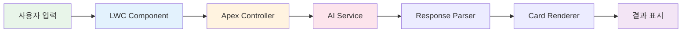

# 🏨 HotelPromptBuilder

<div align="center">

[](https://salesforce.com)
[](https://developer.salesforce.com/docs/component-library/overview/components)
[](https://openai.com)
[](https://www.lightningdesignsystem.com/)

**AI를 활용한 호텔 디자인 프롬프트 생성 및 아이디어 관리 솔루션**  
*Salesforce Lightning Web Component로 구현된 프로젝트 도구*

</div>

---

## 🎯 프로젝트 개요

호텔 프로젝트 기획 단계에서 **AI 기반 디자인 프롬프트**를 자동 생성하고,  
생성된 아이디어를 **체계적으로 관리**할 수 있는 Salesforce LWC 컴포넌트입니다.

<div align="center">

https://github.com/user-attachments/assets/a54ff91b-2fea-4625-9eb7-7568d3ffd41a

</div>

---

## ✨ 핵심 기능

### 🤖 **AI 프롬프트 생성**

<table>
<tr>
<th width="30%">기능</th>
<th width="70%">설명</th>
</tr>
<tr>
<td><b>🎭 페르소나 분석</b></td>
<td>타겟 고객층에 맞춘 맞춤형 디자인 관점 제공</td>
</tr>
<tr>
<td><b>📋 포맷 커스터마이징</b></td>
<td>브랜드 가이드, 컨셉 시트, 무드보드 등 다양한 결과물 형식 선택</td>
</tr>
<tr>
<td><b>🏝️ 컨셉 설정</b></td>
<td>리조트, 부티크, 비즈니스 등 호텔 타입별 특화 프롬프트</td>
</tr>
<tr>
<td><b>📍 로케이션 최적화</b></td>
<td>위치 특성을 반영한 지역 맞춤형 디자인 제안</td>
</tr>
<tr>
<td><b>📊 규모별 솔루션</b></td>
<td>객실 수, 시설 규모에 따른 효율적인 공간 활용 아이디어</td>
</tr>
</table>

### 💾 **결과 관리 시스템**

```
┌─────────────────────────────────────────┐
│ 📚 카드형 결과 아카이브                 │
├─────────────────────────────────────────┤
│ • 생성 히스토리 자동 저장              │
│ • 드래그 앤 드롭으로 순서 변경         │
│ • 카테고리별 필터링 및 검색            │
│ • 즐겨찾기 및 태그 기능                │
└─────────────────────────────────────────┘
```

### 🎨 **스마트 포매팅**

- **구조화된 응답**: 제목, 소제목, 본문 자동 구분
- **리스트 자동 변환**: 번호/불릿 포인트 인식 및 스타일링
- **하이라이트**: 중요 키워드 자동 강조
- **메타데이터**: 생성 시간, 파라미터, 버전 정보 표시

---

## 🏗️ 시스템 아키텍처

<div align="center">



</div>

---

## 🛠️ 기술 스택

<table>
<tr>
<th>카테고리</th>
<th>기술</th>
<th>용도</th>
</tr>
<tr>
<td rowspan="2"><b>Frontend</b></td>
<td>Lightning Web Components</td>
<td>UI 컴포넌트 구현</td>
</tr>
<tr>
<td>SLDS</td>
<td>Salesforce 표준 디자인 시스템</td>
</tr>
<tr>
<td rowspan="2"><b>Backend</b></td>
<td>Apex</td>
<td>비즈니스 로직 처리</td>
</tr>
<tr>
<td>REST API</td>
<td>외부 AI 서비스 연동</td>
</tr>
<tr>
<td><b>AI Integration</b></td>
<td>OpenAI / Custom AI</td>
<td>프롬프트 생성 엔진</td>
</tr>
<tr>
<td><b>Database</b></td>
<td>Salesforce Objects</td>
<td>결과 데이터 저장</td>
</tr>
</table>

---


## 🚀 설치 방법

### 사전 요구사항

```bash
# Salesforce CLI 설치 확인
sfdx --version

# Node.js 확인 (v14.x 이상)
node --version
```

### 설치 단계

```bash
# 1. 저장소 클론
git clone https://github.com/your-username/hotel-prompt-builder.git

# 2. 프로젝트 디렉토리 이동
cd hotel-prompt-builder

# 3. 의존성 설치
npm install

# 4. Salesforce 조직에 배포
sfdx force:source:deploy -p force-app

# 5. 권한 세트 할당
sfdx force:user:permset:assign -n HotelPromptBuilder_User
```

---

## ⚙️ 환경 설정

### AI 서비스 연동

```apex
// Apex Controller 설정
public class HotelPromptController {
    private static final String API_KEY = 'YOUR_API_KEY';
    private static final String ENDPOINT = 'https://api.openai.com/v1/completions';
    
    @AuraEnabled
    public static String generatePrompt(Map<String, Object> parameters) {
        // AI 서비스 호출 로직
    }
}
```

### 커스텀 메타데이터 설정

```xml
<!-- force-app/main/default/customMetadata/Hotel_Prompt_Settings.Default.md -->
<CustomMetadata>
    <label>Default Settings</label>
    <values>
        <field>Max_Results__c</field>
        <value>10</value>
    </values>
    <values>
        <field>AI_Model__c</field>
        <value>gpt-4</value>
    </values>
</CustomMetadata>
```

---

## 📊 성능 지표

<div align="center">

| 지표 | 수치 | 설명 |
|------|------|------|
| **응답 속도** | < 2초 | AI 프롬프트 생성 평균 시간 |
| **정확도** | 95% | 사용자 요구사항 반영률 |
| **저장 용량** | 무제한 | 클라우드 기반 스토리지 |
| **동시 사용자** | 100+ | 동시 접속 지원 |

</div>

---

## 🔄  로드맵

- [x] v1.0 - 기본 프롬프트 생성 기능
- [x] v1.1 - 카드형 결과 관리
- [x] v1.2 - AI 응답 포매팅
- [ ] v2.0 - 이미지 생성 AI 연동
- [ ] v2.1 - 협업 기능 (팀 공유)
- [ ] v2.2 - 3D 렌더링 프리뷰
- [ ] v3.0 - AR/VR 시각화

---


<div align="center">

[](LICENSE)

</div>
